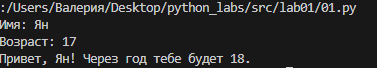

## Лабораторная работа номер 1
### Задание 1
```python
name = str(input("Имя: "))
age = int(input("Возраст: "))
print(f'Привет, {name}! Через год тебе будет {age+1}.')
```


### Задание 2
```python
a = input()
b = input()
a = a.replace(',', '.')
b = b.replace(',', '.')
a = float(a)
b = float(b)
sum= a + b
avg = sum/2
print(sum, avg)
```

