## Лабораторная работа номер 1
### Задание 1
```python
name = str(input("Имя: "))
age = int(input("Возраст: "))
print(f'Привет, {name}! Через год тебе будет {age+1}.')
```


### Задание 2
```python
a = input()
b = input()
a = a.replace(',', '.')
b = b.replace(',', '.')
a = float(a)
b = float(b)
sum= a + b
avg = sum/2
print(sum, avg)
```


### Задание 3
```python
price = float(input())
discount = float(input())
vat = float(input())
base = price * (1 - discount/100)
vat_amount = base * (vat/100)
total = base + vat_amount
print(f'База после скидки: {base:.2f}')
print(f'НДС: {vat_amount:>20.2f}')
print(f'Итого к оплате: {total:>10.2f}')
```


### Задание 4
```python
a = int(input())
time = a//60
b = a % 60
print(f'{time}:{b}')
```


### Задание 5
```python
a, b, c = map(str, input('ФИО: ').split())
print(f'Инициалы: {a[0]+b[0]+c[0]}')
print(f'Длина (символов):{2+len(a)+len(b)+len(c)}')
```


### Задание 6
```python
N = int(input('in_1: '))
Tru, Fals = 0, 0
for i in range(N):
    a, b, c, d = map(str, input('in_'+str(i+2)+': '). split())
    if d == 'True':
        Tru += 1
    else:
        Fals += 1

print('out: ', Tru, Fals)
```


## Лабораторная номер 2
### Задание 1 (arrays.py)
#### 1.1
```python
def min_max(nums: list[float | int]) -> tuple[float | int, float | int]:

    if len(nums) == 0:
        return "ValueError"

    minimum = nums[0]
    maximum = nums[0]
    
    for element in nums:
        if element < minimum:
            minimum = element
        if element > maximum:
            maximum = element

    return(maximum, minimum)

print(min_max([3, -1, 5, 5, 0]))
print(min_max([42]))
print(min_max([]))
print(([1.5, 2, 2.0, -3.1]))
```

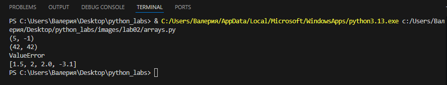
#### 1.2
```python
def unique_sorted(nums: list[float | int]) -> list[float | int]:
    s = []
    for element in nums:
        if element not in s:
            s.append(element) # + елемент, если нет в списке
    
    s.sort() 
    return s

print(unique_sorted([3, 1, 2, 1, 3]))
print(unique_sorted([]))
print(unique_sorted([-1, -1, 0, 2, 2]))
print(unique_sorted([1.0, 1, 2.5, 2.5, 0]))
```

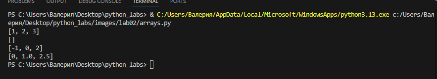
#### 1.3
```python
def flatten(mat: list[list | tuple]) -> list:
    d = []
    for i, row in enumerate(mat):
        if not (isinstance(row, list) or isinstance(row, tuple)): # Список или кортеж
            if isinstance(row, str):
                return "TypeError"
            else:
                return "TypeError"
        # Проходим по элементам строки и просто добавляем их в result
        for elem in row:
            d.append(elem)
    
    return d

print(flatten([[1, 2], [3, 4]]))
print(flatten([[1, 2], (3, 4, 5)]))
print(flatten([[1], [], [2, 3]]))
print(flatten([[1, 2], "ab"]))
```
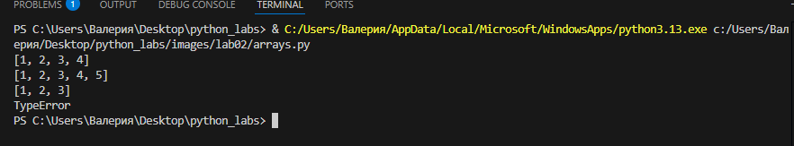

### 2.1
```python
def transpose(mat: list[list[float | int]]) -> list[list]:
    if not mat:
        return []
    row_length = len(mat[0])
    for row in mat:
        if len(row) != row_length:
            return "ValueError"
    result = []
    for col_idx in range(row_length):
        new_row = []
        for row_idx in range(len(mat)):
            new_row.append(mat[row_idx][col_idx])
        result.append(new_row)
    return result


print(transpose([[1, 2, 3]]))
print(transpose([[1], [2], [3]]))
print(transpose([[1, 2], [3, 4]]))
print(transpose([]))
print(transpose([[1, 2], [3]]))
```

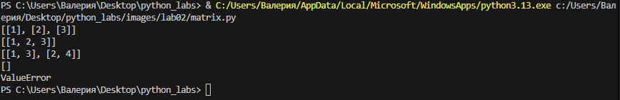
### 2.2
```python
def row_sums(mat: list[list[float | int]]) -> list[float]:
    if not mat:
        return []
    row_length = len(mat[0])
    for row in mat:
        if len(row) != row_length:
            return "ValueError"
    result = []
    for row in mat:
        total = 0
        for val in row:
            total += val
        result.append(total)
    return result

print(row_sums([[1, 2, 3], [4, 5, 6]]))
print(row_sums([[-1, 1], [10, -10]]))
print(row_sums([[0, 0], [0, 0]]))
print(row_sums([[1, 2], [3]]))
```

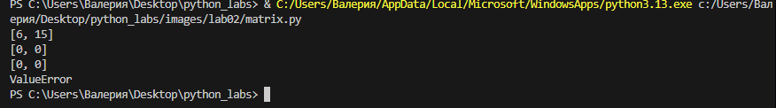
### 2.3

```python
def col_sums(mat: list[list[float | int]]) -> list[float]:
    if not mat:
        return []
    row_length = len(mat[0])
    for row in mat:
        if len(row) != row_length:
            return "ValueError"
    result = []
    for col_idx in range(row_length):
        total = 0
        for row_idx in range(len(mat)):
            total += mat[row_idx][col_idx]
        result.append(total)
    return result

print(col_sums([[1, 2, 3], [4, 5, 6]]))
print(col_sums([[-1, 1], [10, -10]]))
print(col_sums([[0, 0], [0, 0]]))
print(col_sums([[1, 2], [3]]))
```

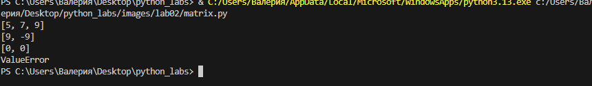
### Задание 3 (tuples.py)
```python
def format_record(rec: tuple[str, str, float]) -> str:
    fio, group, gpa = rec

    if not isinstance(fio, str):
        return ValueError("ФИО должно быть строкой")
    if not isinstance(group, str):
        return ValueError("Группа должна быть строкой")
    if not isinstance(gpa, (float, int)):
        return ValueError("GPA должно быть числом")

    fio = ' '.join(fio.strip().split())
    group = group.strip()

    if not fio:
        return "ValueError"
    if not group:
        return "ValueError"
    
    gpa = float(gpa)

    parts = fio.split()
    if len(parts) < 1:
        return "ValueError"
    surname = parts[0]

    inizial = ''

    if len(parts) >= 2:
        inizial += parts[1][0].upper() + '.'

    if len(parts) >= 3:
        inizial += parts[2][0].upper() + '.'
        
    if len(parts) == 1:
        inizial = ''
    
    if inizial:
        full_name = f"{surname} {inizial}"
    else:
        full_name = surname

    gpa_str = f"{gpa:.2f}"

    return f"{full_name}, гр. {group}, GPA {gpa_str}"

print(format_record(("Иванов Иван Иванович", "BIVT-25", 4.6)))
print(format_record(("Петров Пётр", "IKBO-12", 5.0)))
print(format_record(("Петров Пётр Петрович", "IKBO-12", 5.0)))
print(format_record(("  сидорова  анна   сергеевна ", "ABB-01", 3.999)))
print(format_record(("", "ABB-01", 3.999)))
```
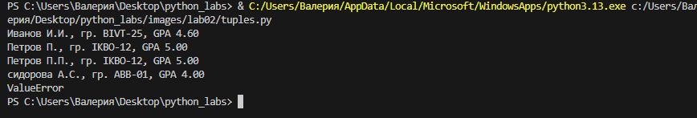


## Лабораторная номер 3
### Задание 1 (text.py)
#### 1.1
```python
def normalize(text: str, *, casefold: bool = True, yo2e: bool = True) -> str:
    if text is None:
        raise ValueError
    if not isinstance(text, str):
        raise TypeError
    if len(text) == 0:
        return ""  
    if yo2e:
        text = text.replace('Ё', 'Е').replace('ё', 'е')
    if casefold:
        text = ' '.join(text.strip().split())
    return text
```

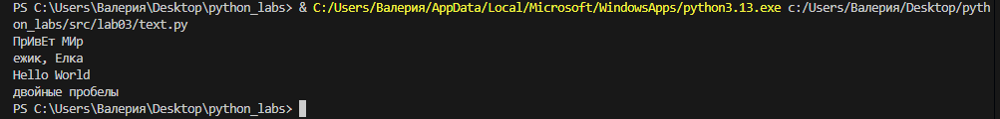
#### 1.2
```python
import re
def tokenize(text: str) -> list[str]:
    return re.findall(r"\w+(?:-\w+)*", text)
```

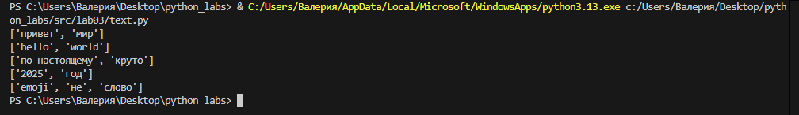
#### 1.3
```python
def count_freq(tokens: list[str]) -> dict[str, int]:
    if not tokens:
        return {}
    freq_dict = {}
    for token in tokens:
        freq_dict[token] = freq_dict.get(token, 0) + 1
    return freq_dict
```


#### 1.4
```python
def top_n(freq: dict[str, int], n: int = 5) -> list[tuple[str, int]]:
    element = list(freq.items())
    element.sort(key = lambda i: (-i[1],i[0]))
    return element
```

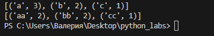

### Задание 2 (text_starts.py)
```python
import sys
from pathlib import Path

lib_path = Path(__file__).parent.parent / 'lib'
sys.path.insert(0, str(lib_path))

from text import tokenize, normalize, count_freq, top_n


def read_stdin() -> str:
    return sys.stdin.read()


def stats(colvo_slov: int, unik_slova: int, top_items):
    print(f'Всего слов: {colvo_slov}')
    print(f'Уникальных слов: {unik_slova}')
    print('Топ-5:')
    for wordy, count in top_items:
        print(f'{wordy}:{count}')


def main():
    text = read_stdin()
    normalized = normalize(text)
    tokens = tokenize(normalized)
    freq_map = count_freq(tokens)
    top = top_n(freq_map, 5)
    stats(len(tokens), len(set(tokens)), top)


if __name__ == '__main__':
    main()
```
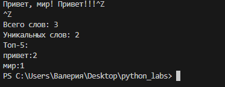


## Лабораторная номер 4
### Задание 1 (io_txt_csv.py)
#### 1
```python
import csv
from pathlib import Path
from typing import Iterable, Sequence

def read_text(path: str | Path, encoding: str = "utf-8") -> str:

    p = Path(path) 
    return p.read_text(encoding=encoding)


def write_csv(rows: Iterable[Sequence], path: str | Path,
    header: tuple[str, ...] | None = None) -> None:
    p = Path(path)
    rows = list(rows)
    if rows:
        s = len(rows[0])
        for element in rows:
            if s != len(element):
                raise ValueError("Все строки должны иметь одинаковую длину")

    with p.open("w", newline="", encoding="utf-8") as f:
        w = csv.writer(f)
        if header is not None:
            w.writerow(header)
        for r in rows:
            w.writerow(r)
```


### Задание 2 (text_report.py)
```python
from src.lab04.io_txt_csv import read_text, write_csv
from lib.text import normalize, tokenize, count_freq, top_n 
import sys

def main(input_path: str = "data/input.txt", output_path: str = "data/report.csv", encoding: str = "utf-8"):

    try:
        text = read_text(input_path, encoding=encoding)
    except FileNotFoundError:
        print(f"Файл не найден")
        sys.exit(1)
    except UnicodeDecodeError:
        print("Неправильная кодировка файла")
        sys.exit(1)
    '''
Означает принудительное завершение программы, передает системе
код завершения 1 ( 0 - успешное завершение, 1 или любое другое значение - завершилось с ошибкой)
'''
    tokens = tokenize(normalize(text))
    freq = count_freq(tokens)
    sorted_freq = top_n(freq)

    rows = sorted_freq
    header = ("word", "count")
    if rows:
        write_csv(rows, output_path, header=header)
    else:
        write_csv([], output_path, header=header)

    total_words = sum(freq.values())
    unique_words = len(freq)
    top_5 = sorted_freq[:5]

    print(f"Всего слов: {total_words}")
    print(f"Уникальных слов: {unique_words}")
    print("Топ-5 слов:")
    for word, count in top_5:
        print(f"{word}: {count}")

if __name__ == "main":
    main()
```

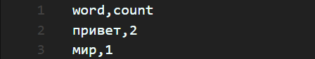
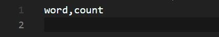

## Лабороторная работа 5
### Задание 1 (json_csv.py)
```python 

import json
import csv
from pathlib import Path


def json_to_csv(json_path: str, csv_path: str) -> None:
    """
    Преобразует JSON-файл в CSV.
    Поддерживает список словарей [{...}, {...}], заполняет отсутствующие поля пустыми строками.
    Кодировка UTF-8. Порядок колонок — как в первом объекте или алфавитный (указать в README).
    """
    json_file = Path(json_path)
    if not json_file.exists():
        raise FileNotFoundError
    
    if json_file.suffix.lower() != '.json':
        raise ValueError
    
    try:
        with open(json_path, 'r', encoding='utf-8') as f:
            data = json.load(f)
    except json.JSONDecodeError as e:
        raise ValueError

    if not isinstance(data, list):
        raise ValueError
    if len(data) == 0:
        raise ValueError
    if not isinstance(data[0], dict):
        raise ValueError
    
    all_keys = set()
    for item in data:
        all_keys.update(item.keys())
    fieldnames = list(all_keys)

    try:
        with open(csv_path, 'w', newline='', encoding='utf-8') as csv_file:
            writer = csv.DictWriter(csv_file, fieldnames=fieldnames)
            writer.writeheader()
            for row in data:
                row_complete = {key: row.get(key, '') for key in fieldnames}
                writer.writerow(row_complete)
    except IOError as e:
        raise IOError(f"Ошибка формата {e}") 
        
json_to_csv('data/lab05/samples/people.json', 'data/lab05/out/people_from_json.csv')


def csv_to_json(csv_path: str, json_path: str) -> None:
    """
    Преобразует CSV в JSON (список словарей).
    Заголовок обязателен, значения сохраняются как строки.
    json.dump(..., ensure_ascii=False, indent=2)
    """
    csv_file = Path(csv_path)
    if not csv_file.exists():
        raise FileNotFoundError

    if csv_file.suffix.lower() != '.csv':
        raise ValueError
    
    try:
        with open(csv_path, 'r', encoding='utf-8') as f:
            reader = csv.DictReader(f)
            
            if reader.fieldnames is None:
                raise ValueError
            
            data = list(reader)
            
    except Exception as e:
        raise ValueError
    
    if not data:
        raise ValueError
    
    try:
        with open(json_path, 'w', encoding='utf-8') as f:
            json.dump(data, f, ensure_ascii=False, indent=2)
            
    except Exception as e:
        raise ValueError(f"Ошибка записи JSON файла: {e}")

csv_to_json('data/lab05/samples/people.csv', 'data/lab05/out/people_from_csv.json')
```
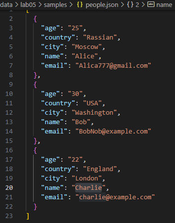
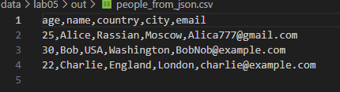
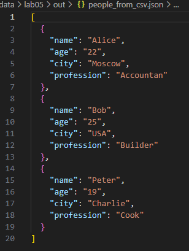
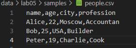

### Задание 2 (csv_xlsx.py)
```python
from openpyxl import Workbook
import csv

def csv_to_xlsx(csv_path: str, xlsx_path: str) -> None:
    """
    Конвертирует CSV в XLSX.
    Использовать openpyxl ИЛИ xlsxwriter.
    Первая строка CSV — заголовок.
    Лист называется "Sheet1".
    Колонки — автоширина по длине текста (не менее 8 символов).
    """
    new_file = Workbook()
    listt = new_file.active
    listt.title = "1"
    
    with open(csv_path, encoding="utf-8") as f:
        for row in csv.reader(f):
                listt.append(row)
        for column in listt.columns:
            mx = 0
            column_letter = column[0].column_letter
            for cell in column:
                mx = max(mx, len(cell.value))
            new_width = max(mx + 2, 8)
            listt.column_dimensions[column_letter].width = new_width
    
    new_file.save(xlsx_path)
from openpyxl import Workbook
import csv

def csv_to_xlsx(csv_path: str, xlsx_path: str) -> None:
    """
    Конвертирует CSV в XLSX.
    Использовать openpyxl ИЛИ xlsxwriter.
    Первая строка CSV — заголовок.
    Лист называется "Sheet1".
    Колонки — автоширина по длине текста (не менее 8 символов).
    """
    new_file = Workbook()
    listt = new_file.active
    listt.title = "1"
    
    with open(csv_path, encoding="utf-8") as f:
        for row in csv.reader(f):
                listt.append(row)
        for column in listt.columns:
            mx = 0
            column_letter = column[0].column_letter
            for cell in column:
                mx = max(mx, len(cell.value))
            new_width = max(mx + 2, 8)
            listt.column_dimensions[column_letter].width = new_width
    
    new_file.save(xlsx_path)
csv_to_xlsx('data/lab05/samples/people.csv', 'data/lab05/out/people.xlsx')
```
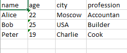  
