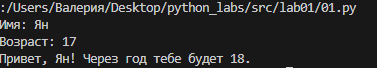
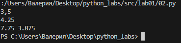
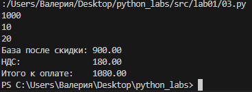
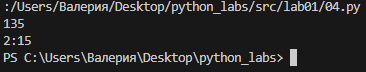
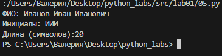
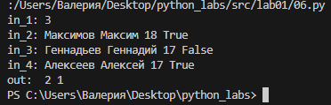

## Лабораторная работа номер 1
### Задание 1
```python
name = str(input("Имя: "))
age = int(input("Возраст: "))
print(f'Привет, {name}! Через год тебе будет {age+1}.')
```


### Задание 2
```python
a = input()
b = input()
a = a.replace(',', '.')
b = b.replace(',', '.')
a = float(a)
b = float(b)
sum= a + b
avg = sum/2
print(sum, avg)
```


### Задание 3
```python
price = float(input())
discount = float(input())
vat = float(input())
base = price * (1 - discount/100)
vat_amount = base * (vat/100)
total = base + vat_amount
print(f'База после скидки: {base:.2f}')
print(f'НДС: {vat_amount:>20.2f}')
print(f'Итого к оплате: {total:>10.2f}')
```


### Задание 4
```python
a = int(input())
time = a//60
b = a % 60
print(f'{time}:{b}')
```


### Задание 5
```python
a, b, c = map(str, input('ФИО: ').split())
print(f'Инициалы: {a[0]+b[0]+c[0]}')
print(f'Длина (символов):{2+len(a)+len(b)+len(c)}')
```


### Задание 6
```python
N = int(input('in_1: '))
Tru, Fals = 0, 0
for i in range(N):
    a, b, c, d = map(str, input('in_'+str(i+2)+': '). split())
    if d == 'True':
        Tru += 1
    else:
        Fals += 1

print('out: ', Tru, Fals)
```

